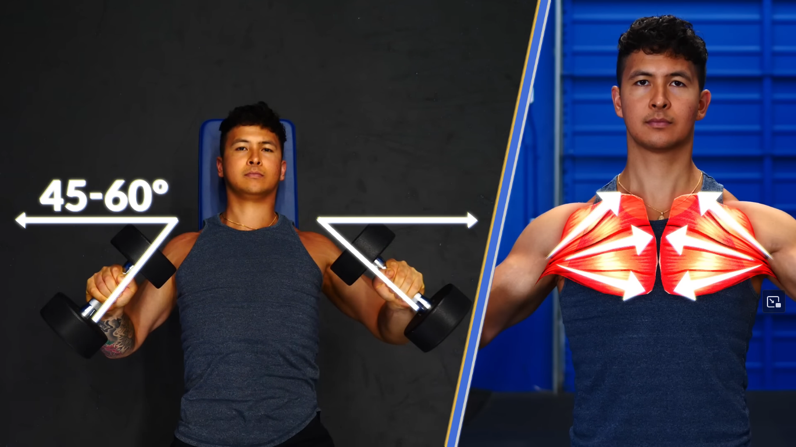

!!! warning "Some reminders/warnings"

    - Progression is important for muscle growth. If overtime the current setup is too easy (i.e: you can do up to 20 reps or it takes 20 reps to reach the *until-failure* bar), apply progressions (ex: add resistance bands for push-ups or put on a weighted backpack. For weights exercises, just increase the weights) [^4]
    - Do not speed up your push-ups, slow down. If it's too easy, slow it down to 2 or 2.5 seconds per push up [^1]$^,$ [^2]
    - When doing push-ups, do not shrug your elbow and do not flare your elbow [^2]

## Sets & Reps

| Type                        | Sets    | Reps          |
| :-----------:               | :-----: | :-------:     |
| `Dumbbell Bench Press`      | 4       | 12            |
| `Narrow (diamond) Push-ups` | 3       | until failure |
| `Hand Release Push-ups`     | 3       | until failure |
| `Push-ups Negatives`        | 3       | until failure |
| `One-sided Push-ups`        | 3       | until failure |

## Dumbbell Bench Press
!!! info

    Flat dumbbell bench press mostly targets the middle part of the chest. Use an incline dumbbell press (just __a very slight incline, abt 15-30 degrees__) variation to also target the upper part of the chest [^10]$^,$ [^11]. To apply this incline variation if you don't have an inclineable bench, just put a plate under the bench. Similarly, use a decline dumbbell press (also __a very slight decline, abt 15-30 degrees__) variation to target the lower chest.

<table>
  <tr>
    <td>  
    </td>
    <td> 
    </td>
    <td>  
    </td>
  </tr> 
</table>

<table>
  <tr>
    <td>  
    </td>
    <td> 
    </td>
    <td>  
    </td>
  </tr> 
</table>

<table>
  <tr>
    <td>  
    </td>
    <td>  
    </td>
  </tr> 
</table>

!!! Warning

    Before going into these push-ups routines, make sure to watch [this video](https://www.youtube.com/watch?v=Z88Rl5bpnmI). It teaches you how to do push-up properly and you will thank your future self [^9].

## Narrow (diamond) Push-ups 

!!! info

    This exercise targets the whole chest (and it aims to replace bench press) [^5]$^,$ [^6]$^,$ [^7]$^,$ [^8]

<table>
  <tr>
    <td>  
    </td>
    <td> 
    </td>
    <td>  
    </td>
  </tr> 
</table>

## Decline Narrow (diamond) Push-ups

!!! info

    This exercise gives more emphasis on the upper chest [^8]. Perform this variation in the same form as in *Narrow (diamond) Push-ups* above, but apply a declination (rest your feet on a bench/chair/couch).

## Incline Narrow (diamond) Push-ups

!!! info

    This exercise gives more emphasis on the lower chest [^8]. Perform this variation in the same form as in *Narrow (diamond) Push-ups* above, but apply an inclination (rest your palms on a bench/chair/couch).

<!--Citations-->
[^1]: [Effect of Push-up Speed on Elbow Joint Loading, Paul Pei-Hsi Chou Et al.](http://ir.lib.kmu.edu.tw/retrieve/7371/780208-5.pdf)
[^2]: [The Perfect Push-Up To Build Muscle, Jeremy Ethier](https://youtu.be/MO10KOoQx5E?t=371)
[^3]: [Dr. Andy Galpin: How to Build Strength, Muscle Size & Endurance | Huberman Lab Podcast #65](https://www.youtube.com/watch?v=IAnhFUUCq6c)
[^4]: [Push-Ups: How To Use Them To Build Muscle](https://www.youtube.com/watch?v=psxMJN7BqIM)
[^5]: [Diamond Push-ups: Benefits, Muscles Used, and More, Debbie Luna, Danial Dominick](https://www.inspireusafoundation.org/diamond-push-ups-benefits/) 
[^6]: Contreras, Bret & Schoenfeld, Brad & Mike, Jonathan & Tiryaki-Sonmez, Raziye & Cronin, John & Vaino, Elsbeth. (2012). The Biomechanics of the Push-up. Strength and Conditioning Journal. 34. 41-46. 10.1519/SSC.0b013e31826d877b.
[^7]: Kim YS, Kim DY, Ha MS. Effect of the push-up exercise at different palmar width on muscle activities. J Phys Ther Sci. 2016;28(2):446-449. doi:10.1589/jpts.28.446
[^8]: [Grow Your Chest At Home: The BEST Home Chest Workout For Growth, Jeremy Ethier](https://www.youtube.com/watch?v=EHR3Rl26-4A&t=461s)
[^9]: [How To Unlock Your Push Up Strength, Jeremy Ethier](https://www.youtube.com/watch?v=Z88Rl5bpnmI)
[^10]: [How To Do Dumbbell Bench Press, Jeremy Ethier](https://www.youtube.com/watch?v=QsYre__-aro)
[^11]: [Rodríguez-Ridao D, Antequera-Vique JA, Martín-Fuentes I, Muyor JM. Effect of Five Bench Inclinations on the Electromyographic Activity of the Pectoralis Major, Anterior Deltoid, and Triceps Brachii during the Bench Press Exercise. Int J Environ Res Public Health. 2020 Oct 8;17(19):7339. doi: 10.3390/ijerph17197339. PMID: 33049982; PMCID: PMC7579505.](https://pubmed.ncbi.nlm.nih.gov/33049982/)
